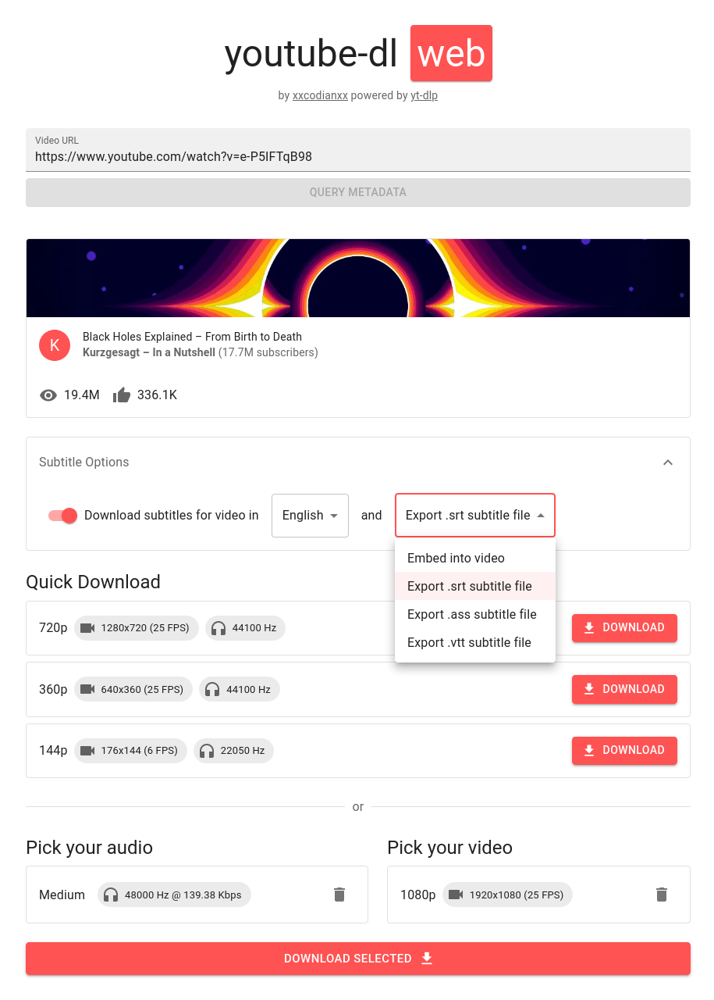

# youtube-dl-web
A good web interface for youtube-dl that allows you to download arbitrary mixes of audio and video, including up to the highest quality such as 8K.

### [Go try it here at yt-dlp.us.to!](https://yt-dlp.us.to/)

## Motive
There is no user-friendly method to download the highest quality of a YouTube video, without errors, and without installing software on your computer.

The web application, **youtube-dl-web** aims to create a user-friendly interface for downloading such videos.

## Features
- Quick Download of pre-encoded YouTube Videos
  
  Most YouTube downloaders would *only* provide the sources that **youtube-dl-web** provides in its Quick Download category.
  Although preservation of quality is important, the Quick Download option is for users who simply just want an mp4, of a decent
  quality, downloaded fast.
 
- Quality Selection

  The most powerful feature of this interface is the ability to select any pair of audio and video for a resulting matroska video file.
  Unfortunately, due to the differing nature of the video and audio containers, matroska is the only option that can be used in order to
  preserve fast download speeds, and original quality. Again, the Quick Download section exists.

- Direct Download Streaming

  Youtube-dl-web never saves a file on the server disk, or makes you wait to start receiving data. As soon as a stream is received from
  YouTube, it immediately starts streaming over to your browser, for a direct download. This also works for the "pick your own" section,
  ensuring download speeds essentially limited only by your network connection.
  
- User Friendly UI
  
  The UI is modern, easy to use and informative. Arguably the biggest limitation of youtube-dl is the command line interface, as most users
  do not know how to use it, and would often go back to subpar websites for downloading videos, at a lower quality.

- Direct Substitution

  You can simply replace "www.youtube.com" with the tool's URL (keeping the watch?v= part), and it will automatically pick up the video URL you
  are trying to use. 
